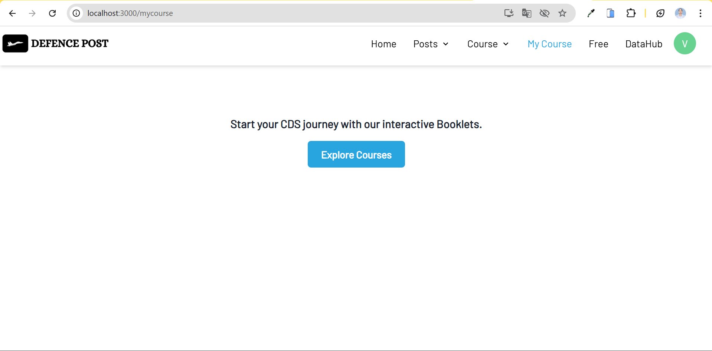

# defence-post
DefencePost delivers unparalleled study materials, offering the most comprehensive and effective notes to empower CDS students on their path to success.
### 1. Backend Repo link
[Explore the backend code for DefencePost at this link.](https://github.com/VaishnaviDhobale/DefencePost-Backend)

### 2. Admin Repo link 
[View the DefencePost admin panel code here.](https://github.com/VaishnaviDhobale/DefencePost-Admin)

## User Side – Tech Stack
- JavaScript
- React.js
- Chakra-UI

## Check Out the Slides
**1. Home Page**

  

**2. Post Page**

  

**3. Post Details Page**

  

**4. Course Page**

  

**5. Course Details Page**

  

  

**6. Payment Page**

  

**7. My Course**

  

**8. Free content **

  

